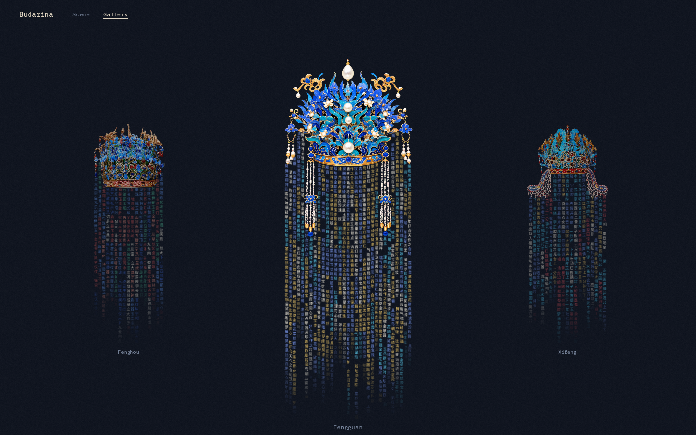

# 凤冠字帘 · Chinese Phoenix Crown

> 一件可以"拨动"的数字文物——七顶中国凤冠悬于午夜蓝的夜幕中，冠下垂落由汉字织成的珠帘，指尖拂过，字缕如流苏般摇曳作响。

**在线体验：<https://chinese-phoenixcrown.vercel.app>**

## 视频演示

https://github.com/user-attachments/assets/25382d23-489d-4f71-b4b5-ad2c539a8e42

> 75 秒完整演示，包含场景切换、文字帘拨动与交互音效。

## 项目简介

本项目复刻并再创作了"屋檐下垂落文字帘"的交互效果：每一顶凤冠（点翠、翠玉、金丝、婚冠、戏冠、冰冠、后冠……）下方悬挂着一条由汉字组成的帘幕。字符池取自与冠物气质相配的诗文与吉语——婚冠垂"金枝玉叶、十里红妆"，后冠垂"母仪天下、九龙四凤"，戏冠垂京剧行当术语——帘色也逐字取自冠上实物的点翠蓝、花丝金、宝石红。

鼠标拂过帘幕，字缕会像真实的珠串一样被拨开、回摆，并发出金属风铃般的清脆声响。



## 核心特性

- **物理文字帘**：Canvas 上的 Verlet 链式物理模拟，每条字缕都是可拨动的珠串，沿凤冠轮廓（图片 alpha 通道采样）自然垂落
- **双视图**：
  - **Scene** —— 单冠全景，左右卡片切换，凤冠间由 View Transitions API 驱动"神奇位移"过渡
  - **Gallery** —— 三冠并排陈列，中间大、两侧小，点击侧冠换焦、点击中冠入景
- **合成音效**：纯 Web Audio API 合成——拨动时的布料沙沙声 + 非谐波泛音叠加的金属铃音（明亮 ping、闪烁长尾、珠串回击），音量与音色随手速变化，无任何音频文件
- **性能优化**：字形图集（glyph atlas）预光栅化 + `drawImage` 盖章渲染、图集坐标节点级缓存、DPR 上限 1.5、透明尾字剔除，数千字符实测稳定 60 fps
- **七顶凤冠**：点翠凤冠 Fengguan、翠玉冠 Cuiyu、金冠 Jinguan、金簪婚冠 Jinzan、戏冠 Xifeng、冰鸾冠 Bingluan、凤后冠 Fenghou

## 技术栈

| 层 | 技术 |
| --- | --- |
| 框架 | Next.js 16（App Router）+ React 19 |
| 渲染 | Canvas 2D + 字形图集，Verlet 物理 |
| 过渡 | View Transitions API（共享元素 morph） |
| 音效 | Web Audio API（合成，无音频资源） |
| 样式 | Tailwind CSS v4，暗色单主题 |
| 部署 | Vercel |

## 本地运行

```bash
pnpm install
pnpm dev
```

打开 <http://localhost:3000>，先在页面任意处点击一次（浏览器音频解锁），再拨动文字帘即可听到铃音。

## 交互提示

| 操作 | 效果 |
| --- | --- |
| 鼠标拂过帘幕 | 字缕被拨开、回摆，伴随沙沙声与铃音 |
| 快速扫动 | 摆幅更大，铃音更亮、偶有珠串二次回击 |
| 点击左右小卡片 | 神奇位移切换至相邻凤冠 |
| 顶部 Scene / Gallery | 单景与三冠陈列间无缝变形切换 |

## Built with v0

本仓库关联 [v0](https://v0.app) 项目，每次合并到 `main` 会自动部署。

[Continue working on v0 →](https://v0.app/chat/projects/prj_6cygJ0e3W0QQOhPnNWylAPMJBYX6)
